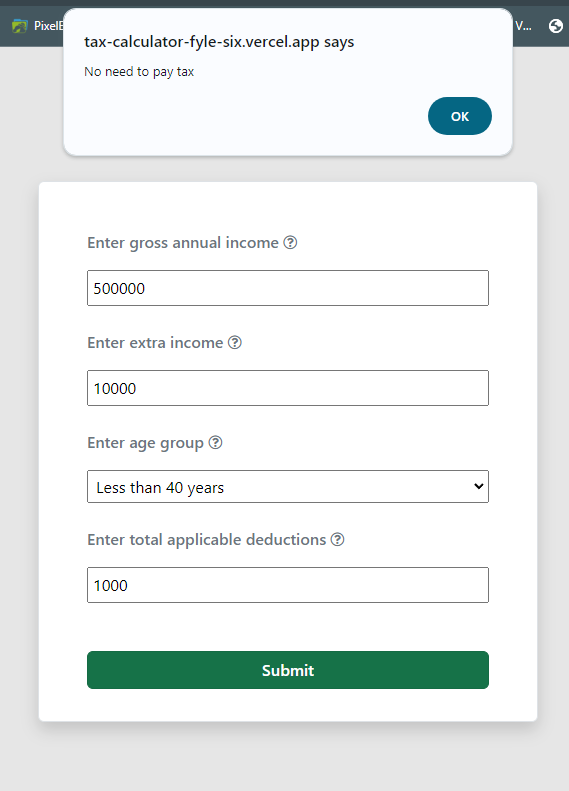
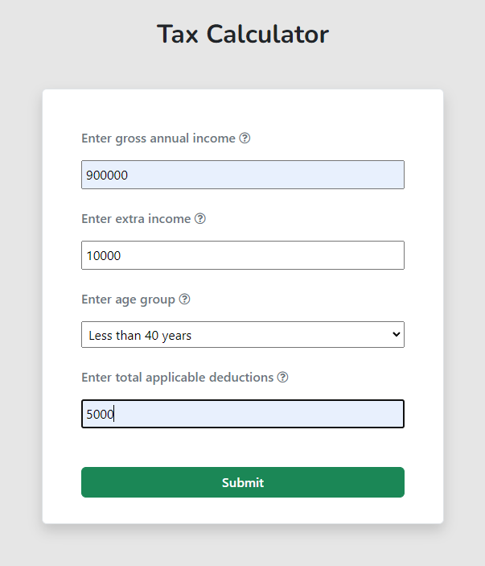
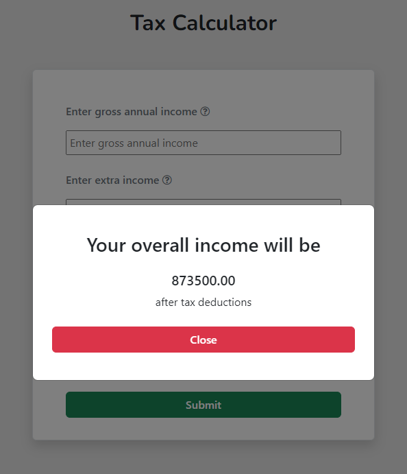
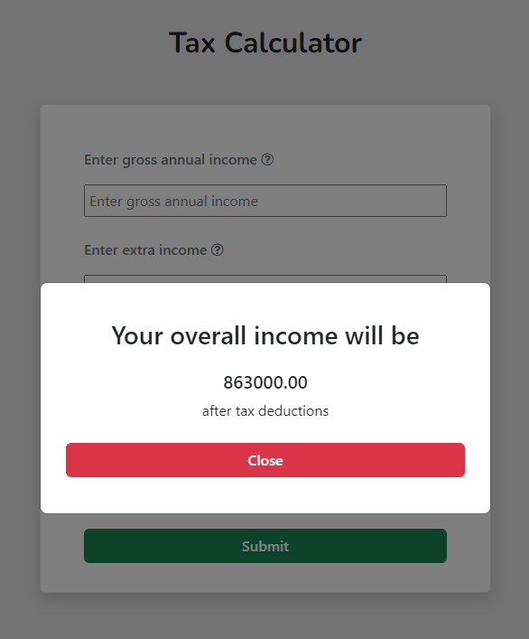
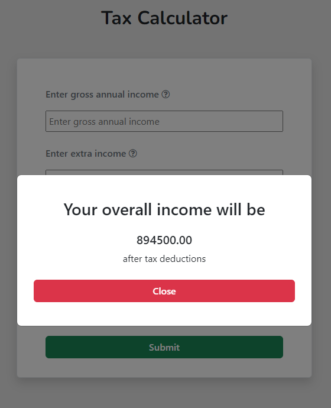
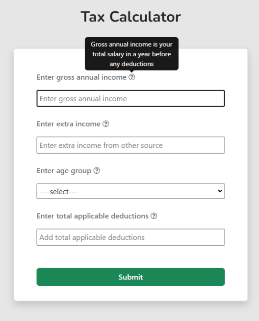
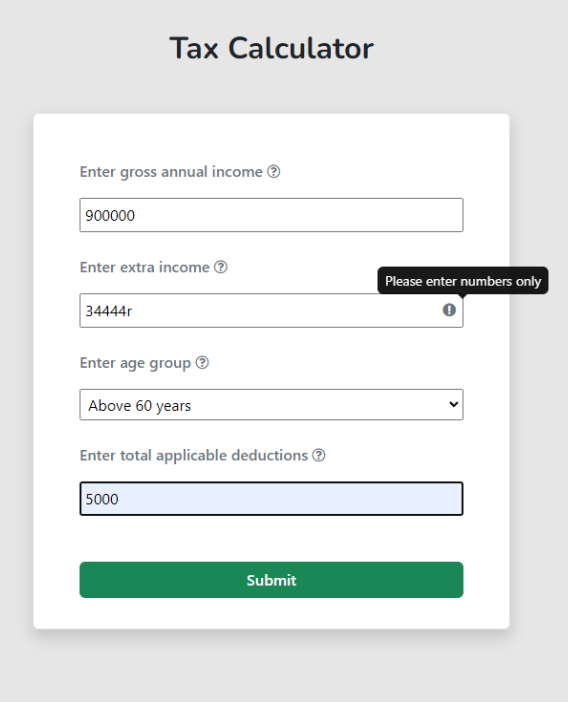
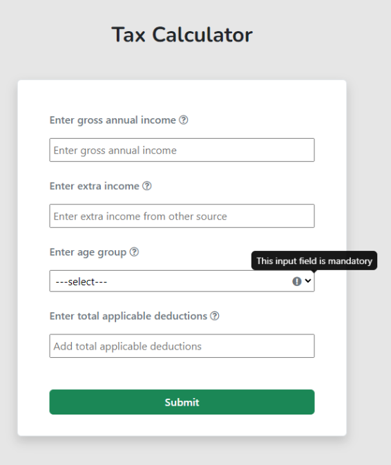

# Tax Calculator - Fyle

To run this project on your local system, you must follow these steps:

- Download the project zip file from GitHub
- Extract the zip file
- Since we are using Bootstrap CDN, no need to install anything
- Open the whole project foleder in your code editor
- Now you can run this project using live server or by manually opening the index.html file

## Live preview 

This web application is hosted on Vercel, you can check through this link:

https://tax-calculator-fyle-six.vercel.app/

## Test cases of all the requirements

- ### Overall income is less than 8 lakhs

    

    Since the overall income is 500000 + 10000 - 1000 = 509000, which is less than 8 Lakhs, hence no need to pay tax

- ### Overall income exceeds 8 lakhs

    

    Since Overall income is 900000 + 10000 - 5000 = 905000 which is greater than 8 lakhs and the age group is <=40 then after charging the tax the overall income will be

    

    Now if we change the age group to >=40 and < 60 then after charging the tax overall income will be

    

     Now if we change the age group to >=60 then after charging the tax overall income will be

     

- ### Tooltip for every field

    By hovering the question mark after every input field we can know more about the field through a tooltip. Let's see this with an image

    

- ### Error(!) while entering character in number field

    Here we are not restricting the input fields only with number though only the number will work. If user enters a character then he/she will get a exclamation mark(!) on the right end of the input box, on hovering over the exclamation icon it will show "Please enter numbers only".

    

    In the extra income field since 'r' is a character so we got an exclamation, by hovering this we can see a tooltip.

- ### Error(!) while age group is not selected

    If we click on Submit without selecting the age group then we will get an exclamation mark on the right end of the age group field. We can see a tooltip by hovering this saying "This field is mandatory"

    

